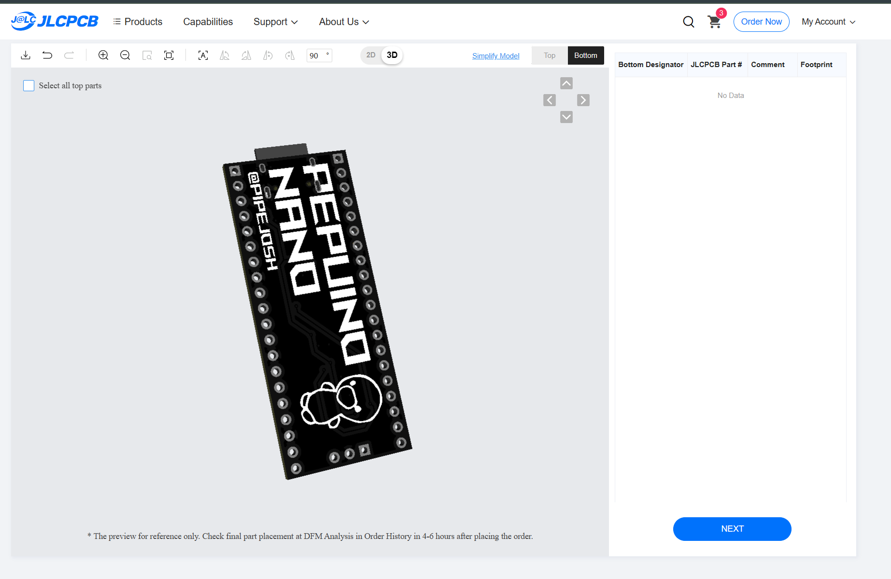
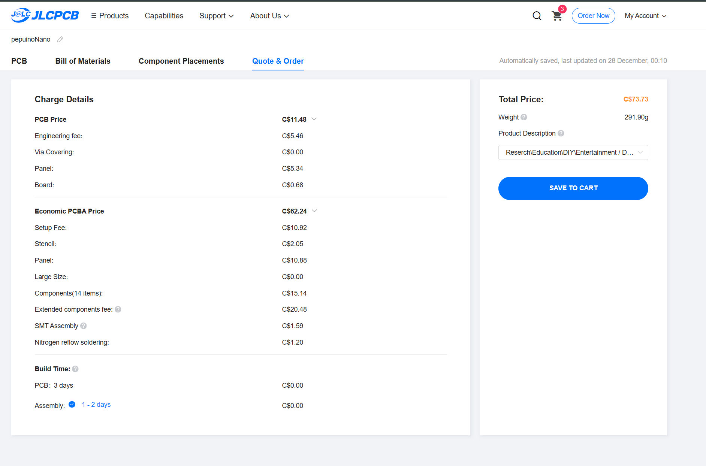

# Pepuino Nano V1

This is a develpment board, that is ahead of its time, featuring and amazing design, and a RP2040, custom made from scratch following the diagram from the pico

## Images!!

### Renders
 
 

### PCB
 

### Schematic
 

### BOM

 
